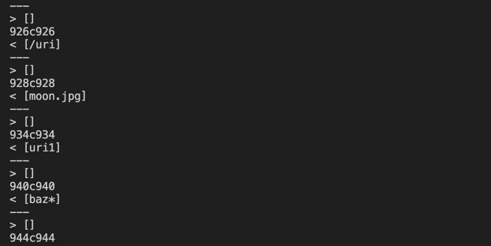
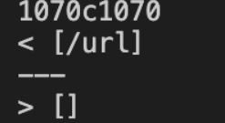

# Week 10 Lab Report

## Find tests with different results
In order to find tests with different results between my implementation of markdown-parse and the provided implementation,

* I use command `bash script.sh > results.txt` to save the outputs of my markdown-parse into `results.txt` file.
* Then I use the same command to save the outputs of the provided markdown-parse into `results.txt` file in another repository.
* Then I use program `diff` to show the differences between the two `results.txt` files in different repositories. The command and outputs are as the following:
* 
* 
* 
* 
* 
* 

## Test 1
Based on the outputs above, another test with different results is in 516.md (line 928).

* The actual output for my markdown-parse is [], while the actual output for the provided markdown-parse is `[moon.jpg]`.
* 

* * Based on the preview, the expected output should be `[/uri]`, so both implementations are wrong.
* 

* The problem with the provided implementation is that it does not consider the situation when there is () between []. In this situation, content between () is not the correct link. Rather, content between the () after the [] should be the link. The following part of code does not consider this situation. The variable openParen refers to the index of ( that first appears in the file. This makes the method findCloseParen make the ) that first appears to be closeParen. Thus, content between the () between the [] will be added to toReturn, causing the output to be `[moon.jpg]`.
* 

## Test 2
Based on the outputs above, one test with different results is in 580.md (line 1070).

* The actual output for my markdown-parse is [], while the actual output for the provided markdown-parse is `[/url]`.
* 

* Based on the preview, the expected output should be [], so my implementation is correct, and the provided one is not
* 

* The problem with the provided implementation is that it does not consider the situation when there is nothing between [], which leads to the situation when the link between () cannot be displayed. The following part of code does not consider this situation. It does not check if there is content between [] and directly adds the link between () to toReturn and return it, causing the output to be `[/url]`. 
* 