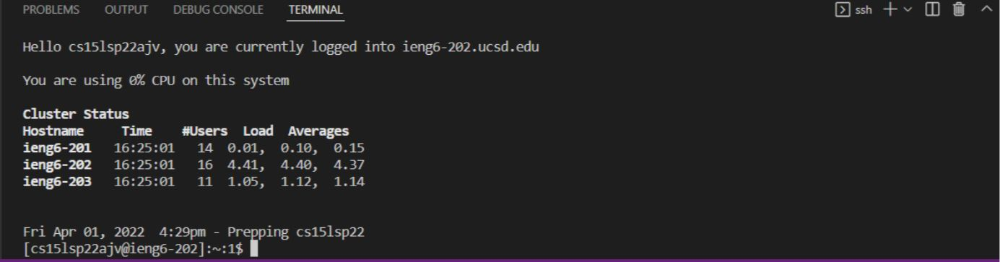
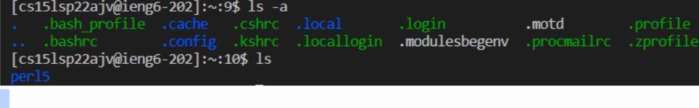
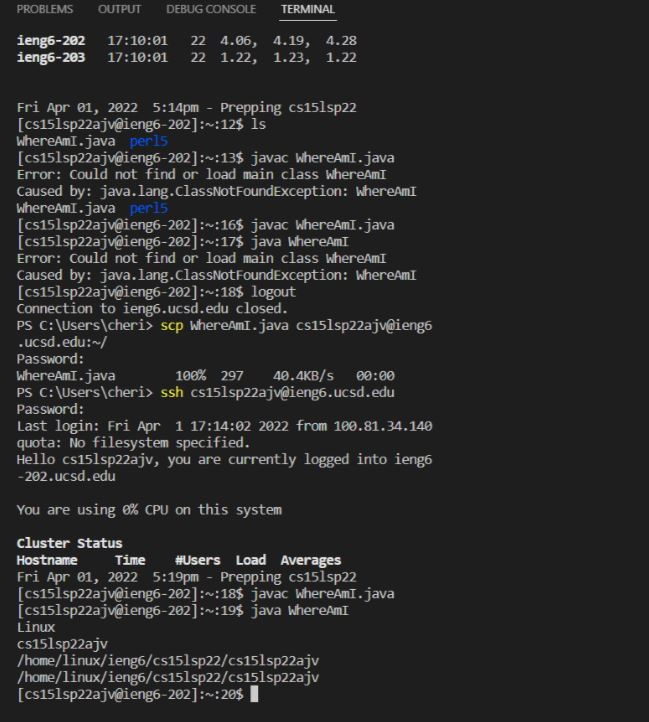
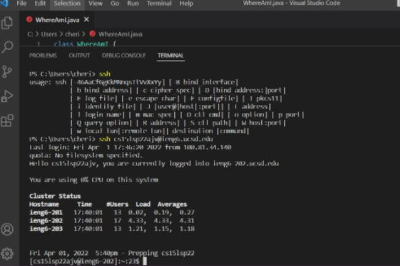
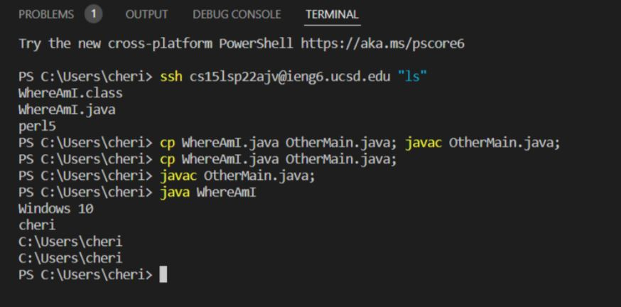

# Week 2 Lab Report

`Installing VScode`: This is not my first time installing VScode. I went to the Visual Studio Code website to download the version for Windows. I opened VScode and it came up with a new file that is named untitled-1.

`Remotely Connecting`:

`Trying Some Commands`:

`Moving Files with scp`:

`Setting an SSH Key`:

`Optimizing Remote Running`:
