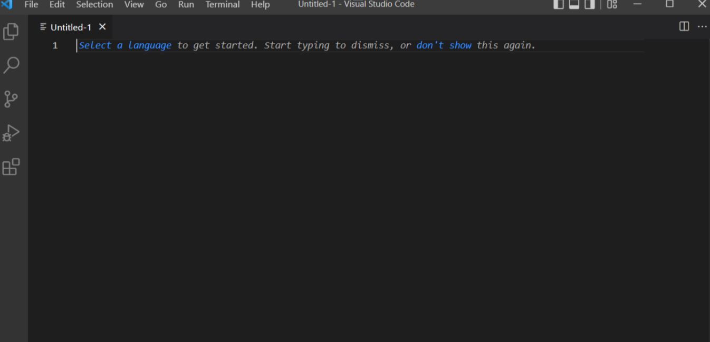
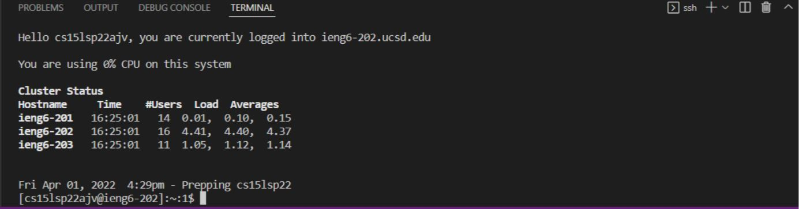
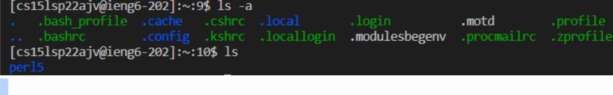
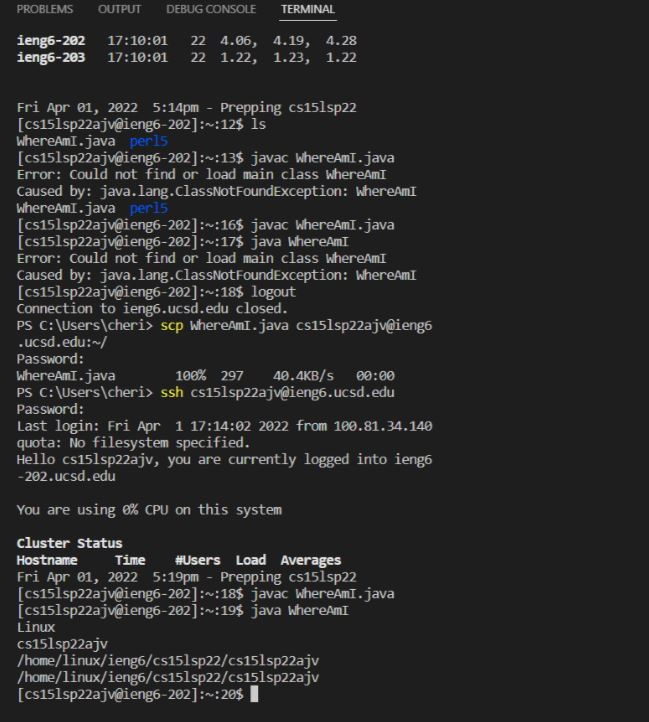
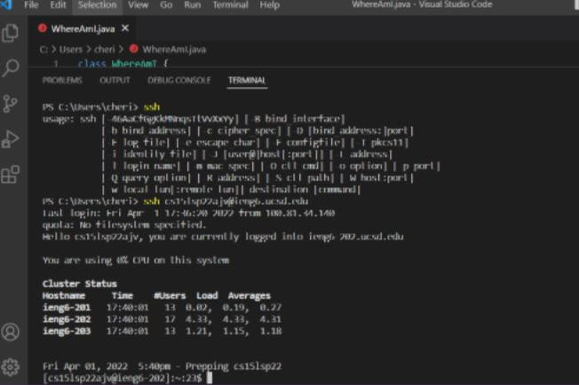
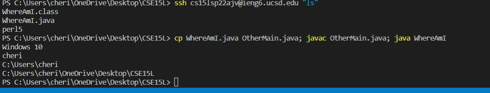

# Week 2 Lab Report

### Installing VScode
This is not my first time installing VScode. I went to the [Visual Studio Code](https://code.visualstudio.com/) to download the version for Windows. I opened VScode and it came up with a new file that is named untitled-1.

### Remotely Connecting 
My first time connecting to the server, I used my specific course username start with cs15lsp22 to connect with this new server. Once it estabilied, I re-entered my username and put in my password. Once it got connected, my computer(client) will welcome me and show my cluster status.

### Trying Some Commands
The command I have tried was `ls` -a. When I tried `ls -a`, it lists all the information. However, when I just put `ls`, it will only say perl5, because -a doesn’t ignore entries starting with period. 

### Moving Files with scp
When I run on the client device it shows Windows 10 cheri, which tells my personal device. And when the server runs it, it shows Linux cs15lsp22ajv. getProperty means get property of the system java file is on 

### Setting an SSH Key
Since it always ask me to put in my password and takes me a lot of time doing that, I set up an SSH Key. In order to do that, I used a program called `ssh-keygen` (first step: type `ssh-keygen` in command), it create a pair of key both on server(public key) and client(private key) (put my password in command two times to create keys). Both of the keys are stored in `.ssh` directory on my computer, so next time I don't need to re-enter my password to login in.

### Optimizing Remote Running
In order to directly run something on the remote server, I first use `cs15lsp22ajv@ieng6.ucsd.edu "ls"` to login in and list the home directory on remote server in one line. And use `cp WhereAmI.java OtherMain.java; javac OtherMain.java; java WhereAmI` to run the file

