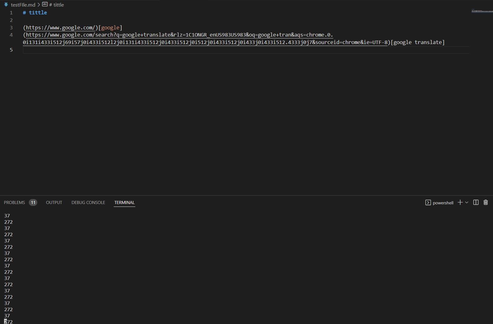
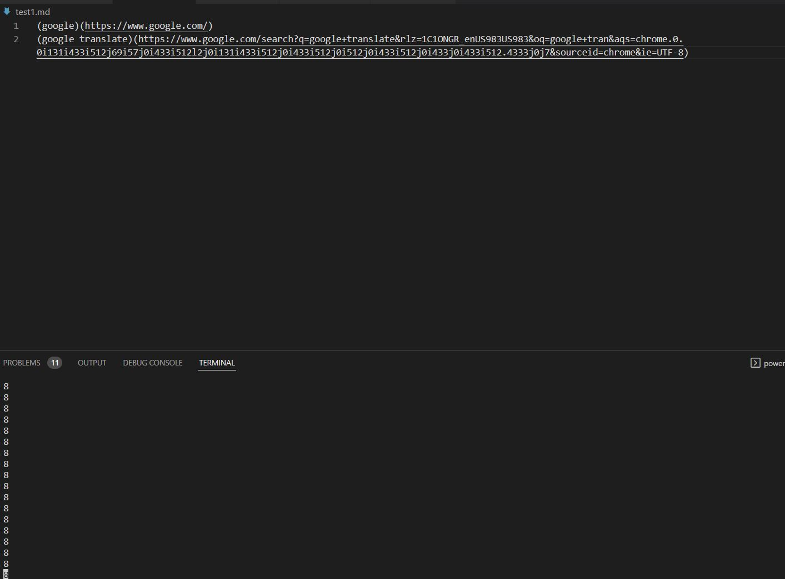
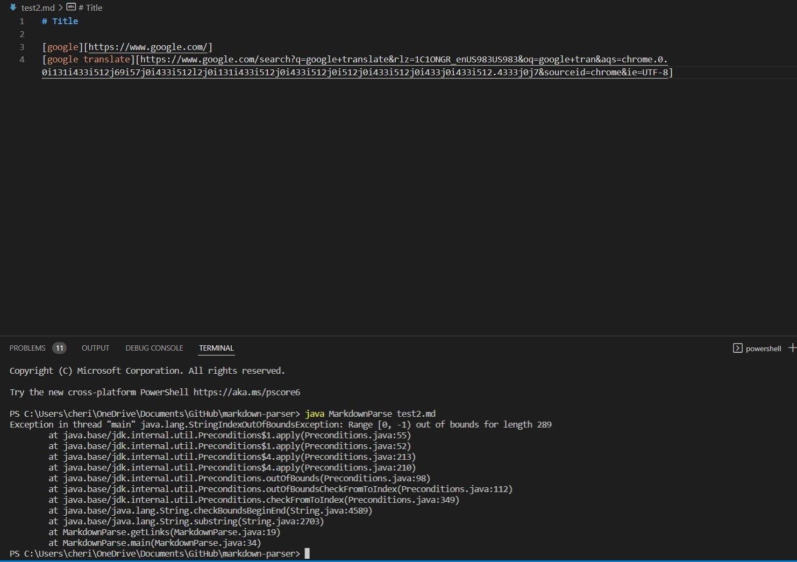

# Week 4 Lab Report

## File that starts with a link
### [Test File 1](testFIle.md)

## File that uses `[]` but not `()`
### [Test File 2](test1.md)

## File that uses `()` but not `[]`
### [Test File 3](test2.md)

