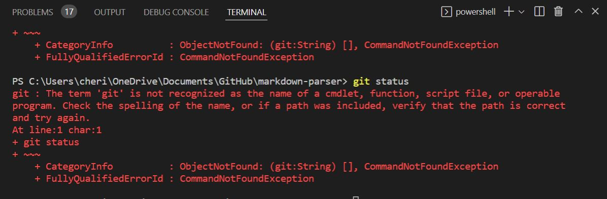
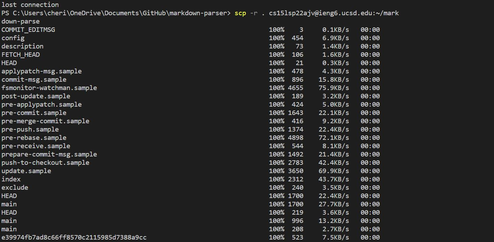
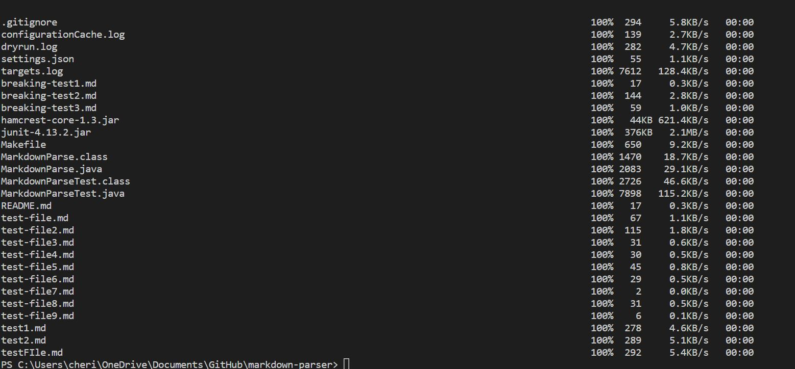
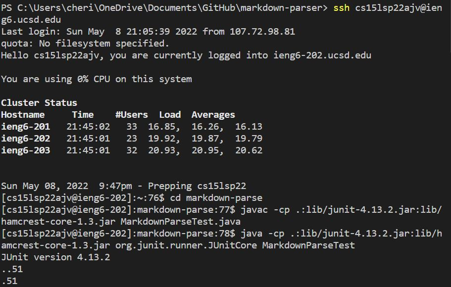
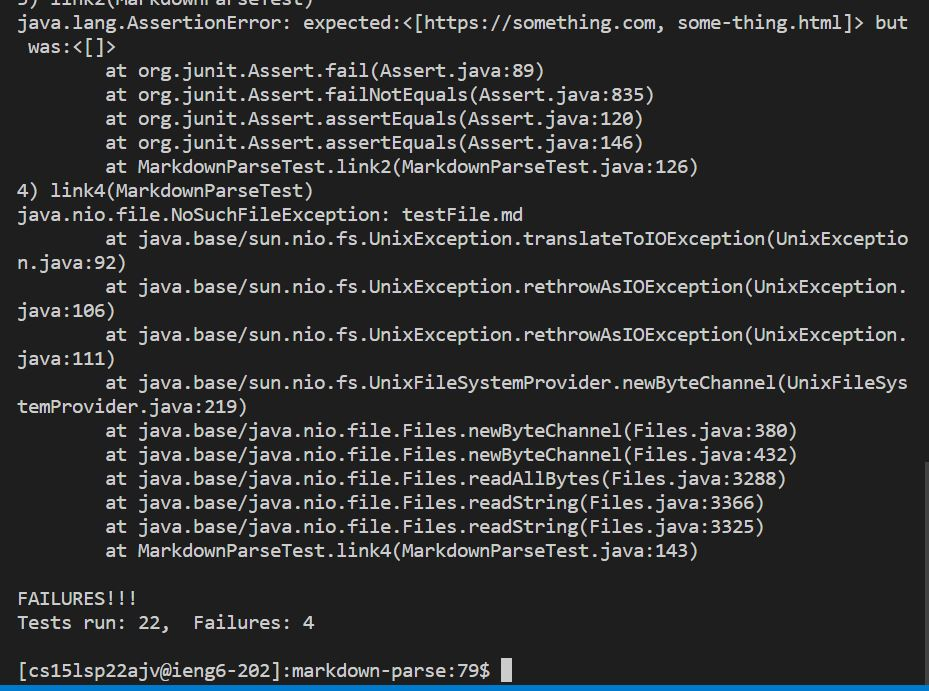
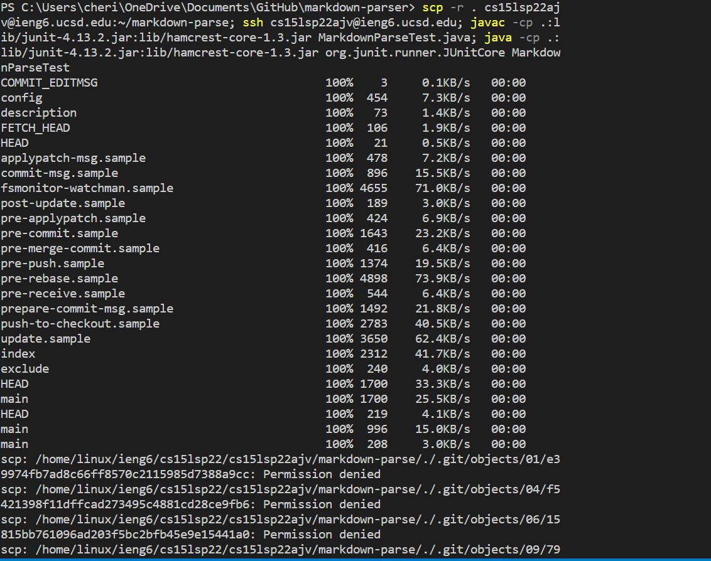
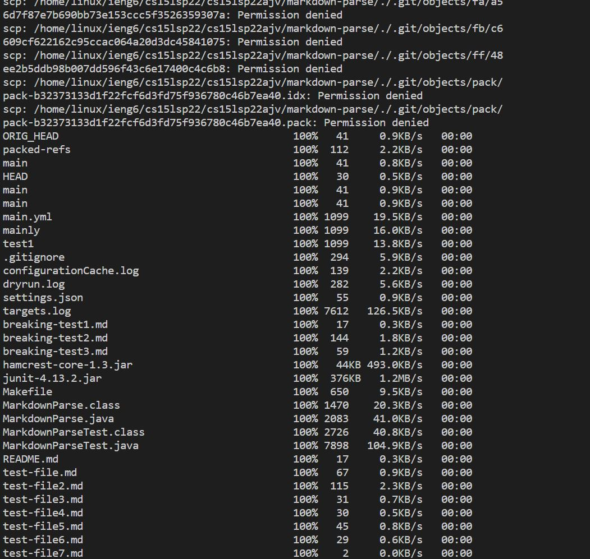
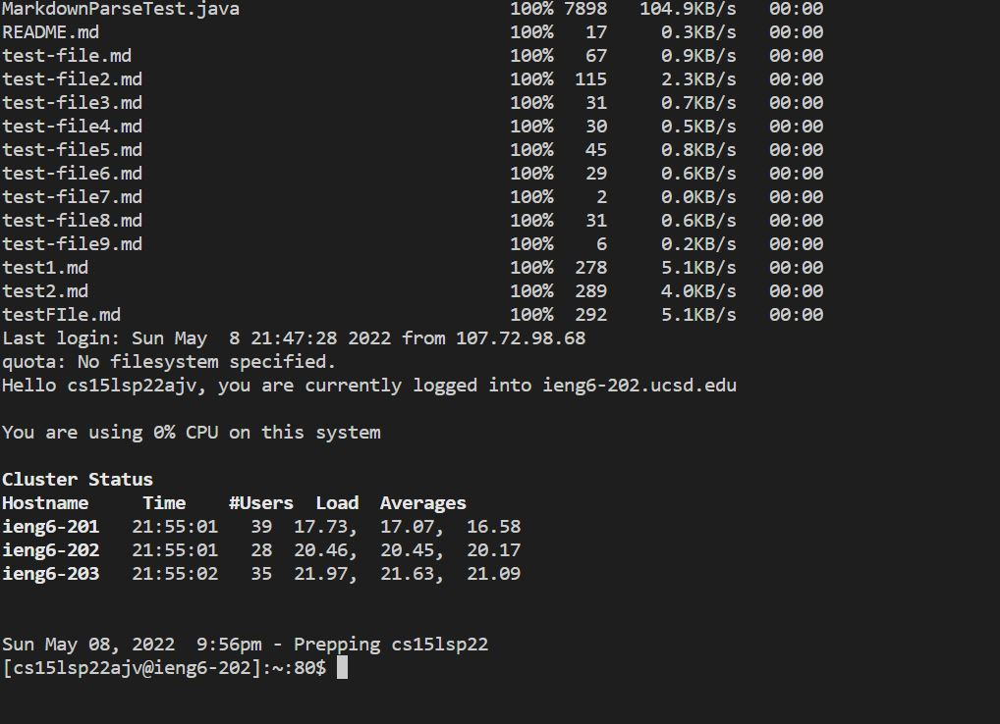

# Week 6 Lab Report
## Streamlining ssh Configuration

* After entering `~/.ssh/config` in the terminal, it tells SSH what username to use when logging into specific servers, and  give servers nicknames.
* I edit it in VScode, and make sure I used my username

* And now when I can login to `ieng6` faster by typing in `ssh ieng6`

* If I want to use `scp` command copying a file to your account, I just need to type `scp XXX.java ieng6`

## Set up Github Access from ieng6

* I have error of using `git`, I will go ask during next office hour

## Copy whole directories with `scp -r`

* The code copies the whole markdown-parse directory to my ieng6 account.
* The `-r` option makes `scp` work recursively.
* The `.` is the source, and is the current directory.
* The `~/markdown-parse` creates a markdown-parse directory on the remote server and then `scp` copies the contents of this directory recursively there.

* The code helps me log into the server

* The code helps me cd into the markdown-parse directory.
* It then compiles and runs MarkdownParseTest.java file on the server

* The code combines several commands to copy the whole directory and run the tests on the server in one line.
* `scp -r` copies the whole directory to the server.
* `ssh` logs me into the server.
* `cd` gets me into the markdown-parse directory.
* `javac` and `java` compile and run the tests on the server