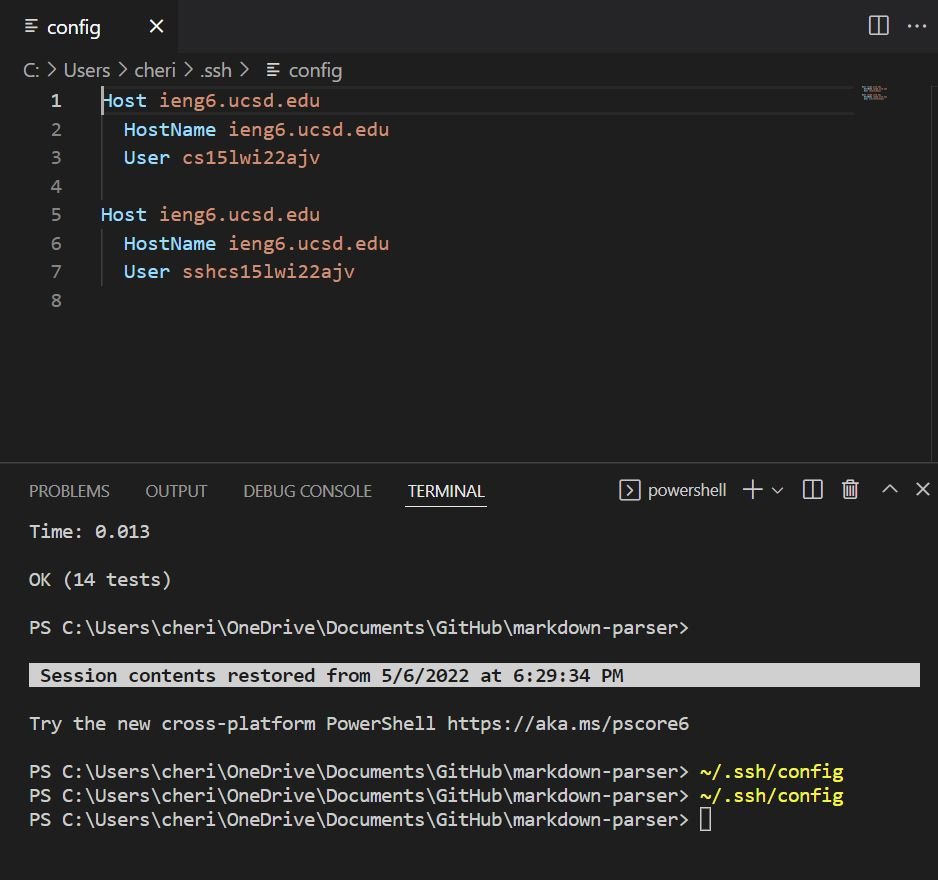
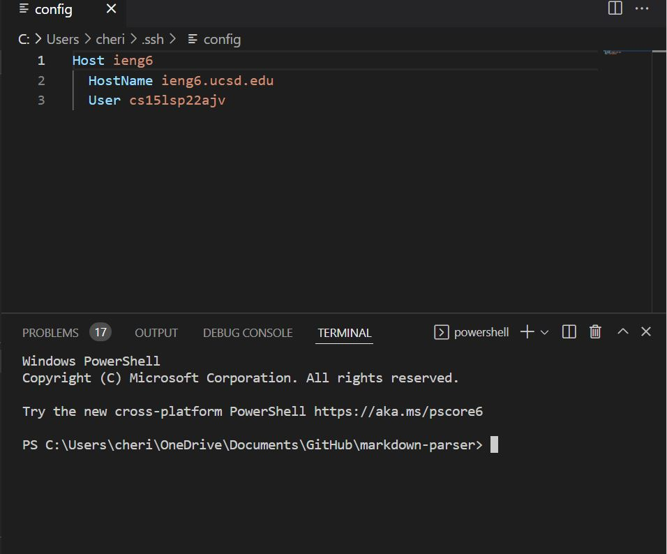
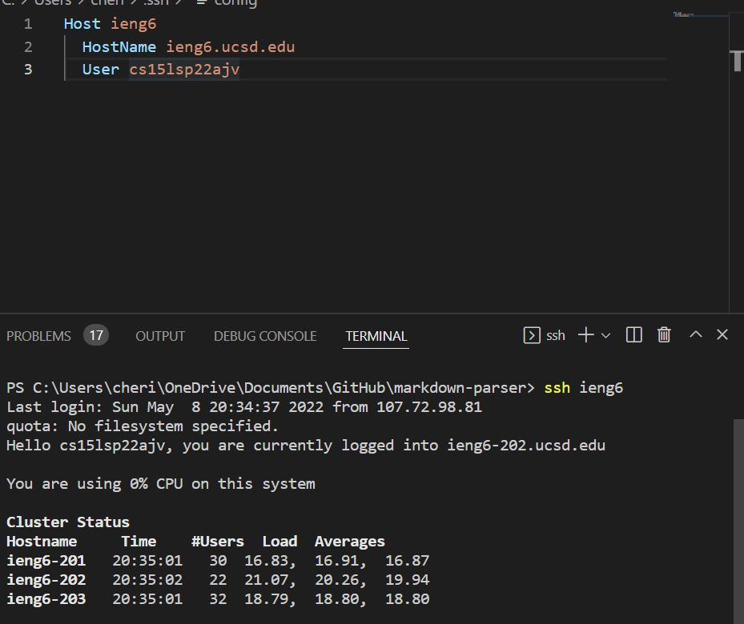
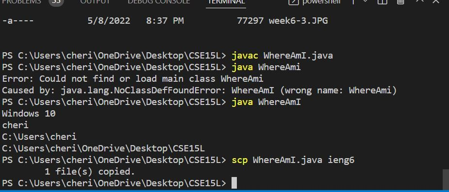

# Week 6 Lab Report
## Streamlining ssh Configuration

* After entering `~/.ssh/config` in the terminal, it tells SSH what username to use when logging into specific servers, and  give servers nicknames.
* I edit it in VScode, and make sure I used my username

* And now when I can login to `ieng6` faster by typing in `ssh ieng6`

* If I want to use `scp` command copying a file to your account, I just need to type `scp XXX.java ieng6`

## Set up Github Access from ieng6
